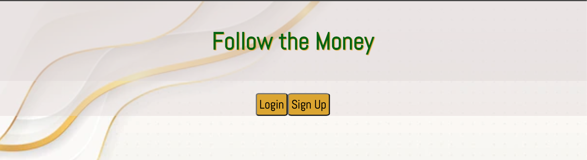

# Follow the Money :money_with_wings:

A budget-tracking app to manage your bills and wish list items.

You can add your expenses and wish list items for each month of the year. Keep track of your spending habits, and see where your money is going every month.

## Getting Started:
[Signup](https://gerimae-oliva-budget-tracking.herokuapp.com/)!

Login to your account, or signup, and start adding your monthly bills, expenses and/or wish list items

## Next Steps:
* Signup/Login authentication for individual users to manage their own monthly expenses and/or wish list items
* Create a new expense or wish list item for each month
* Edit any expense or wish list item
* Delete any expense or wish list item
* View a compiled list of bills/expenses and wish list items for each month

## Technologies Used:
* HTML, CSS, JavaScript
* NodeJS, Express, REACT
* MongoDB, Heroku
* VS Code
* [GitHub](https://github.com/g0livax27/Budget-Tracking-App/projects) for trello board
* [Diagrams.net](diagrams.net) for wireframes